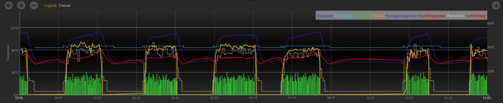

# esp-kwb-mqtt-ha-logger
---

ESP-based data logger (to MQTT & HomeAssistant) for KWB Easyfire 2 pellet boiler (and probably similar ones)

The idea is to read values from the RS485 bus, which connects KWB room devices (thermostat) to the boiler, and to publish read values to a MQTT broker and eventually to HomeAssistant.

Currently, published values are:

| Name                        | Unit        | Example |
|--------------               |-----------  |------------|
| Boiler Temperatur           | °C          | 54.2°C |
| Puffer Temperatur Oben      | °C          | 54.2°C |
| Puffer Temperatur Unten     | °C          | 54.2°C |
| Kessel Temperatur           | °C          | 75.2°C |
| Kessel Rücklauf Temperatur  | °C          | 45.2°C |
| Kessel Rauchgas Temperatur  | °C          | 102.2°C |
| Außentemperatur             | °C          | 10.7°C |
| Heizkreis Vorlauftemperatur | °C          | 45.2°C |
| Gebläse                     | RPM         | 2562 RPM |
| Saugzug                     | RPM         | 1500 RPM |
| Kessel Zündung              | Boolean     | Aus |
| Raumaustragung              | Boolean     | Aus |
| Störung                     | Boolean     | An |
| Reinigung                   | Boolean     | Aus |
| Kesselpumpe                 | Boolean     | Aus |
| Heizkreispumpe              | Boolean     | Aus |
| Boilerpumpe                 | Boolean     | Aus |
| Rauchsauger                 | Boolean     | Aus |
| Kessel Unterdruck           | mbar        | 20.2 mbar |
| Kessel Photodiode           | %           | 54% |
| Kessel Energie              | kWh         | 25.37 kWh |
| Kessel Zustand              | String      | Brennt |
| Kessel Brennstunden         | time         | 03:45:46 h |

HomeAssistant (or other software) allows creating graphs from these values, like:



Values are published over MQTT and these are discoverable according to the HomeAssistant logic (auto discovery by HomeAssistant). Listen to `homeassistant/sensor/#` on your MQTT broker to see discovery information and also where the actual data is published.

## My specific hardware:

* Wemos D1 mini (ESP8266)
* MAX485 (RS485 bus to UART serial converter), e.g. https://www.amazon.com/-/de/dp/B088Q8TD4V/

Connect like:
```
ESP8266             MAX485             RS485 Bus

RX -------------- RO       A ---------- A

VCC (5V) -------- VCC      B ---------- B

GND ------------- GND - RE - DE
```

I'm supplying my ESP from a USB power adapter. VCC and GND from the RS485 bus aren't used. I'm not entirely sure whether this is correct, but it works. @windundsterne suggested using a TL7800 to convert the 24V of the bus to 5V for the ESP, so no USB power adapter is needed.

I'm using a Wemos D1 mini and the serial UART. To flash the device, RX must be disconnected from the MAX485.

You can find the original wiring scheme and some pictures from @windundsterne in the pictures' folder.

## How to compile:

This code was created with ArduinoIDE (2.0.3) and is Arduino C++.

1. Install Arduino IDE
2. Open the program (as a sketch)
3. Add ESP libraries (File - Preferences - Board Manager URL - https://arduino.esp8266.com/stable/package_esp8266com_index.json )
4. Install ESP8266 Boards via board manager
5. Install needed libraries via Tools - Manage Libraries
  1. home-assistant-integration (v2.0.0)
  2. PubSubClient (v2.8.0)
6. Select your ESP board via Tools - Board
7. Rename conf.h.template to conf.h and fill in your values
8. Compile
9. Flash/Upload

The resulting device is OTA capable (via Arduino IDE) and the OTA process can be secured with a password.

## Changes from @windundsterne and @Duetting repositories

* Removed unnecessary code
* Removed some comments & reworked others
* Removed MQTT publishing code and replaced it with Arduino HomeAssistant library (which includes MQTT)
* Removed software serial code entirely (UART is used)
* Removed debug MQTT code & replaced it with my own implementation
* Improved code styling (according to my taste)
* Improved overall readability
* Improved & added:
  * photodiode range now matching 0-100% (for my boiler)
  * boiler state also publishes "Neustart" additionally to "Brennt" and "Aus"
  * Raumaustragung now also measures a Saugzug, not just a Schnecke
  * Proper recording of
    * RLAVentil
    * Heizkreismischer
  * Publishing of
    * Boilerpumpe
    * Heizkreispumpe
    * Rauchsauger
* Only publishing known and working values (not like Temp0-Temp19)

## Finding specific bits and values for your KWB device

Depending on how your KWB device is wired up, some things might be registered at other positions than on mine. To find these positions:

1. Activate byte publishing by setting `bool publishUnknown = true;`
2. Listen to `kwb/#` via MQTT (e.g. via  `mosquitto_sub -h IP -u USERNAME -P PASSWORD -v -t kwb/#`)
3. Use the relay test function at your KWB device to trigger specific things
4. Compare printed bytes between the function (e.g. printed bytes for function on, printed bytes for function off)
5. Count bytes and bits to find the position for your function (e.g. byte 7, bit 0 changed from 0 to 1 to 0; always count from 0)
6. alter the code to apply your found position by e.g. using `getbit(anData, 7, 0);`

## To-dos

* Some comments are still unclear
* Translate everything to English
* Find new sensors & states
* Rework code in function "otherStuff"

## Acknowledgements

Many thanks to Dirk Abel for his reverse engineering of the KWB protocol: https://www.mikrocontroller.net/topic/274137

Many thanks to @windundsterne for his initial program

Many thanks to @Duetting for his additions (more values to report)
